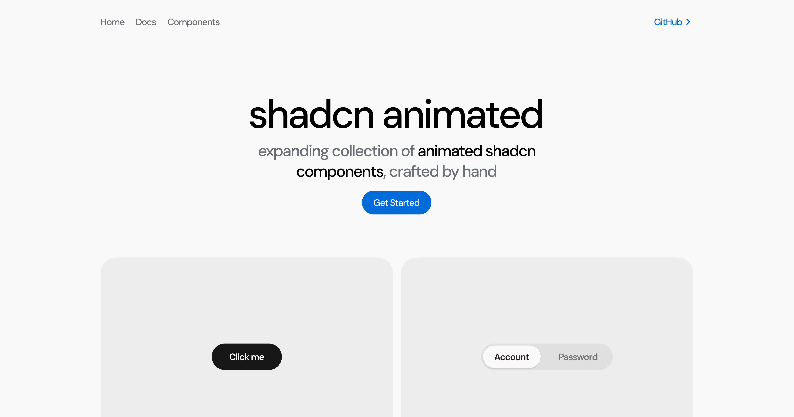

# shadcn animated

**Expanding collection of animated [shadcn/ui](https://ui.shadcn.com/) components, crafted by hand**

## Documentation

Visit the [documentation](https://shadcn-animated.vercel.app) for examples, usage, and installation instructions.

## Install shadcn animated

```jsx
npm i shadcn-animated
```

### Install components

```jsx
npx shadcn-animated add button
```

## Usage

Use the components just like you would use shadcn/ui components:

```jsx
import { Button } from "shadcn-animated";

export default function App() {
  return <Button>Button</Button>;
}
```
## 💬 Have a question or idea?
[Start a discussion →](https://github.com/sopo/shadcn-animated/discussions)

## Issues

If you encounter a problem, please open an issue on [GitHub](https://github.com/sopo/shadcn-animated/issues).
