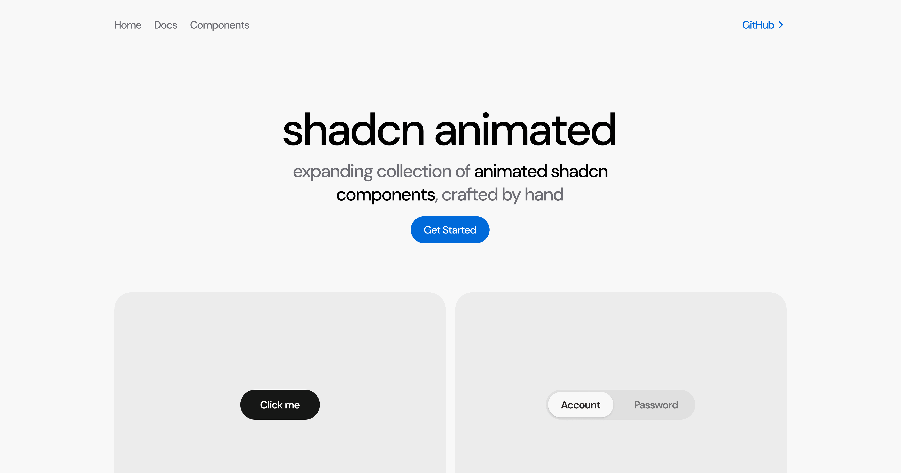

# shadcn animated

**Expanding collection of animated [shadcn/ui](https://ui.shadcn.com/) components, crafted by hand**

→ Visit the [documentation](https://shadcn-animated.vercel.app) for examples, usage, and installation instructions.

## Components

### Image card
```bash
npx shadcn-animated add image-card
```

<video src="https://github.com/user-attachments/assets/e7482896-f906-47eb-9954-2d8ac1cf104d" controls></video>


### Button

```bash
npx shadcn-animated add button
```
<video src="https://github.com/user-attachments/assets/f48c60d8-cdf5-449c-89a0-ad35a9371c59" controls></video>

### Icon toggle

```bash
npx shadcn-animated add icon-toggle
```

<video src="https://github.com/user-attachments/assets/0a7e565e-0a7d-409a-b889-68d3b26b1a16" controls></video>
### Navigation button forward

```bash
npx shadcn-animated add navigation-button
```

<video src="https://github.com/user-attachments/assets/0fc8faa2-5929-43b9-a4e6-6fe97a26f4d9" controls></video>
### Navigation button back
```bash
npx shadcn-animated add navigation-button
```

<video src="https://github.com/user-attachments/assets/c2487263-7e94-4414-bb29-40a147fe55f3" controls></video>


## Install shadcn animated
```jsx
npm i shadcn-animated
```

### Install components

```jsx
npx shadcn-animated add button
```

## Usage

Use the components just like you would use shadcn/ui components:

```jsx
import { Button } from "shadcn-animated";

export default function App() {
  return <Button>Button</Button>;
}
```

## 💬 Have a question or idea?

[Start a discussion →](https://github.com/sopo/shadcn-animated/discussions)

## Issues

If you encounter a problem, please open an issue on [GitHub](https://github.com/sopo/shadcn-animated/issues).
